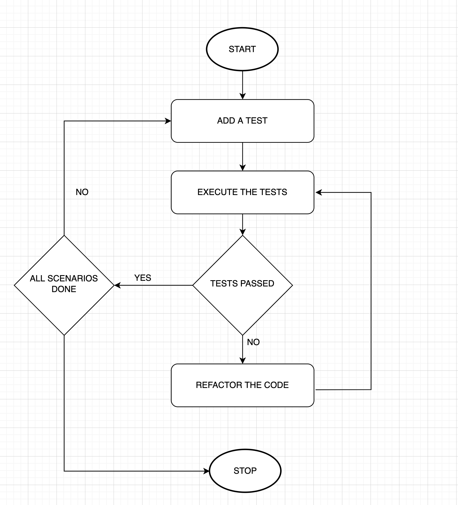
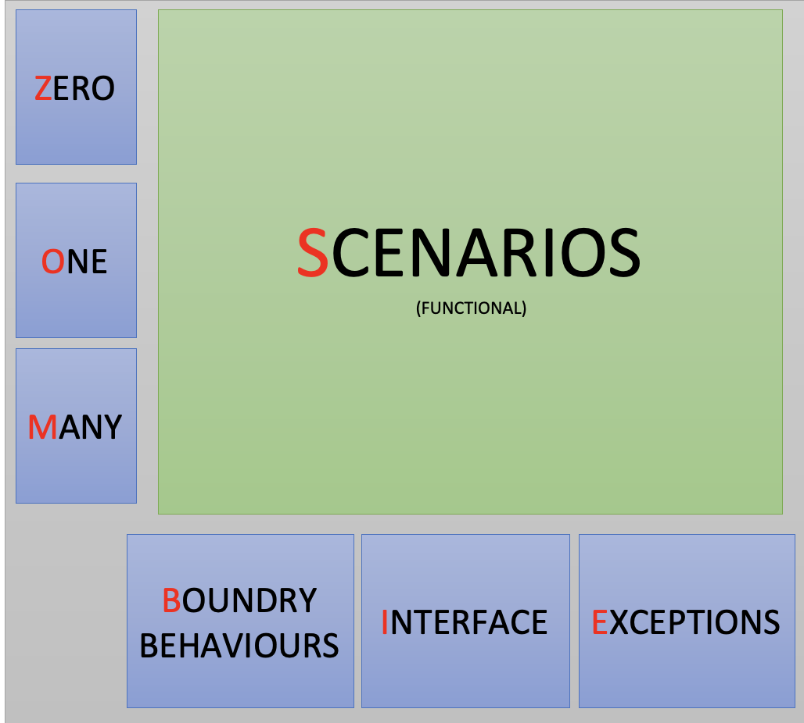

# TDD : Test Driven Development

##What is Test Driven Development (TDD)?

Test driven development is a methodology/technique/process in which development
is driven by tests. In other words, we can say that TDD is a design technique
which can be used while writing code.

In TDD, you first start writing tests before making any code changes. And then
write new functional code or refactor that code to make sure tests start
passing. It is a rapid cycle of testing, coding, and refactoring.

##WHY TDD? 

General trend while writing JUnits:

* Not writing tests frequently
* Writing too many unit tests at once
* Writing unit tests that are either testing too many methods at the same time
* Writing unit tests without proper assertions
* Writing unit tests with minimum number of assertions

### Do we really need to fail a test?

##Benefits of TDD:

* Optimized code with right patterns and design
* Loosely-coupled code and modular design
* Easier to maintain by Anyone
* Easier to refactor by Anyone
* High test coverage
* Improve overall team collaboration
* Increase confidence that the code works as expected

##Disadvantages of TDD:

* No silver bullet
* Learning curve
* Feels like a slow process
* Everyone in the team has to do it.
* Any change in code - Tests have to be written and fix the old not working tests.

##WOW! I know TDD now, What next?

You might start writing tests but after a few tests, you are back to a situation
where you can't think of what to write next and might leave a lot of code untested.

###Scary feeling !

Here comes ZOMBIES to help us:

* Z – Zero
* O – One
* M – More complex
* B – Boundary Behaviors
* I – Interface definitions
* E – Exceptional behavior
* S – Scenarios

You can start with a few very basic tests and then proceed covering different 
scenarios, boundary behaviors, interfaces and exception conditions.
Most important point is to test the behaviour of the APIs, methods.

This approach is going to help you in covering almost all the critical scenarios
and will make sure you are taking care of production code behaviors.

##Reference

http://blog.wingman-sw.com/archives/677
